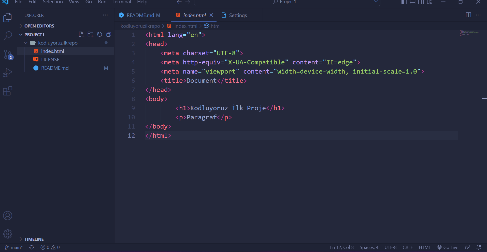

# Kodluyoruz İlk Repo
Kodluyoruz Eğitimi kapsamında açtığım ilk repo. İçerisinde bir adet README dosyası bir adet de index.html bulunuyor.

## Installation
Öncelikle projeyi clonelayın.
```bash
 git clone https://github.com/bektsahmt/kodluyoruzilkrepo.git
```

## Usage
Projeyi cloneladıktan sonra Visual Studio Code programında açınız.

Linux İçin: 
 ```bash 
 cd kodluyoruzilkrepo 
 code .
```

## Contributing
Pull requestler kabul edilir. Büyük değişiklikler için, lütfen önce neyi değiştirmek istediğinizi tartışmak için konu açınız.

## License 
[MIT]


